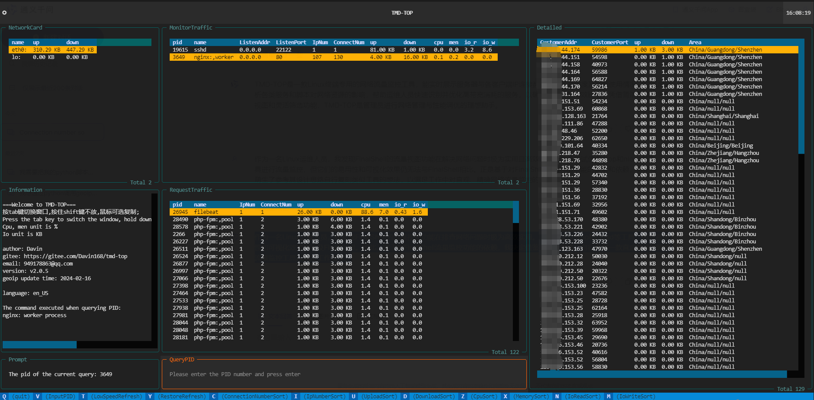
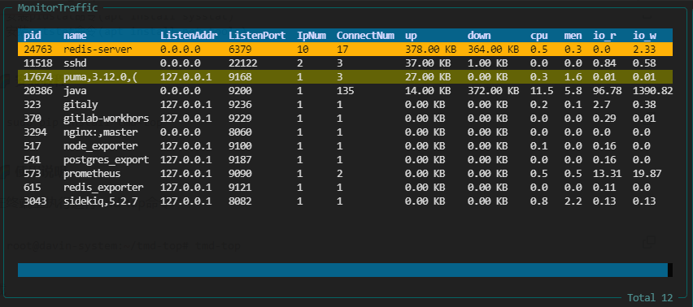
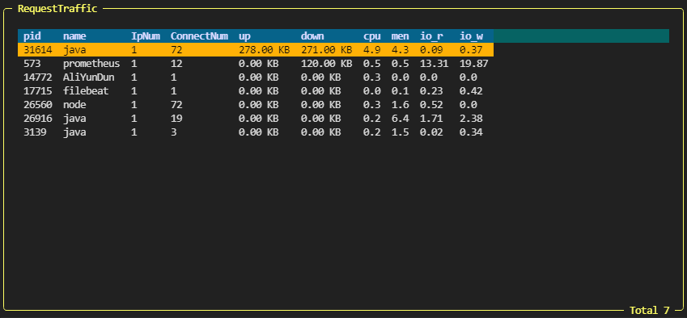
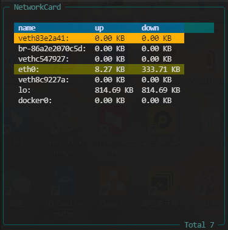
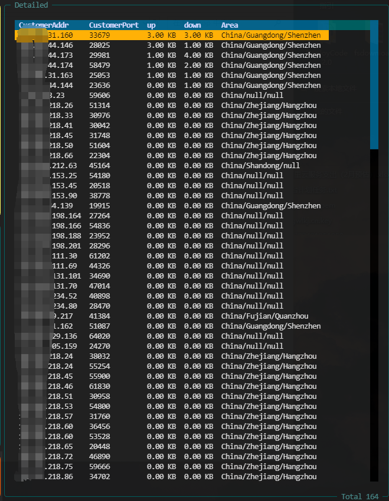

------


####  🌈 介绍

|🌐[[ 中文说明 ](/README.md)]  |🌐 [[ English   Introduction ](/en-README.md)] |

😈TMD🖕TOP  是一款Linux终端专用的网络流量监控工具，能实时展示服务器与各客户端IP连接数、上传下载速度及带宽使用情况。它深度分析各类服务和脚本对网络资源的影响，帮助运维人员快速识别并优化高带宽消耗的服务，以确保系统性能高效稳定。凭借简洁易读的表格视图和灵活筛选功能，TMD-TOP是管理员进行网络管理与性能调优的理想助手。 

顺手点个star⭐



####  🌈 版本要求

 **👊注意：**

```txt
python >= 3.8
```

####  🌈 安装教程

```shell
sudo pip install tmd-top
```

#### 🌈更新

```shell
sudo pip install --upgrade tmd-top
```

####  🌈 使用说明

在终端上执行运行tmd-top命令

```shell
root@davin-system:~/tmd-top# tmd-top
```

####   🌈 快捷指令

快捷指令


```txt
"q"---quit    #退出
'v'---InputPID		#输入pid进行查询
't'---LowSpeedRefresh		#慢速刷新数据
'y'---RestoreRefresh		#恢复刷新数据速度
'c'---ConnectionNumberSort	#连接数排序
'i'---IpNumberSort		#ip数量排序
'u'---UploadSort			#上传排序
'd'---DownloadSort 		#下载排序
'z'---CpuSort				#cpu排序
'x'---MemorySort			#内存排序
'n'---IoReadSort			#io读排序
'm'---IoWriteSort			#io写排序
```


####  🌈 IP识别

**数据来源:** ip识别是使用geoip来实现的，目前geoip的更新时间是：  ⌚️ 2024-08-13


####  🌈 数据展示图

**服务器监听流量**



**服务器运行程序产生的流量**



**服务器网卡流量**



**详细客户端流量**



####  🌈 创作想法

 作为一名Linux运维人员，我发现FinalShell的流量视图功能在排查网络问题时极为高效实用。尽管尝试过iftop和nload等工具，但其易用性和可视化效果均不及FinalShell。因此，鉴于对FinalShell流量监控功能的依赖，我决定借鉴其设计思路，自行开发一款直观精确的网络流量监控工具以满足工作需求。  

####  🌈 软件架构
1. 这里是列表文本数据收集模块：通过Python的subprocess或os库执行Linux底层命令（如netstat），实时获取服务器内部TCP连接的状态信息。这些信息包括但不限于客户端IP、端口、连接状态、传输速率等关键指标。

2. 这里是列表文本数据库存储模块：利用SQLite作为本地持久化存储解决方案，将收集到的TCP连接数据以结构化形式写入数据库表中。此模块负责创建和管理数据库连接，以及执行SQL插入操作。

3. 数据处理模块：对原始数据进行预处理和格式化，例如转换为适合存储在SQLite中的格式，并可能进一步进行数据分析，计算出如每秒上传下载速度、并发连接数等高级统计指标。

4. 用户界面展示模块：基于textual库构建终端界面，动态显示从数据库中读取的TCP连接统计数据。


请作者喝杯咖啡

如果该项目对你有帮助，帮您解决了问题，可以请作者喝杯咖啡！！!

