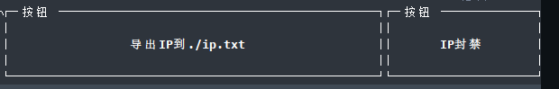

------


###  🌈 Introduce

|🌐[[ 中文说明 ](/zh-README.md)]  |🌐 [[ English   Introduction ](/README.md)] |

 😈🖕TMD-TOP is a network traffic monitoring tool specifically designed for  Linux terminals. It provides real-time displays of server connections to various client IPs, upload and download speeds, and bandwidth usage. By deeply analyzing the impact of different services and scripts on  network resources, it assists administrators in quickly identifying and  optimizing high-bandwidth-consuming services to ensure efficient and  stable system performance. With its clean and readable tabular view and  flexible filtering functions, TMD-TOP is an ideal assistant for  administrators to perform network management and performance tuning. 

**Give it a star ⭐ if you find it useful (it's very important to me).**


### 🔨 Version Requirements

 **⚠️ontice：**

```txt
python >= 3.8

Linux system
```

###  🌈 Install

```shell
sudo pip install tmd-top
```

### 🔄Update

```shell
sudo pip install --upgrade tmd-top
```

### 📖Usage Instructions

Run the tmd-top command on the terminal

```shell
root@davin-system:~/tmd-top# tmd-top
or
root@davin-system:~/tmd-top# tmd
```

### ⌨️ Shortcut Commands


| 快捷指令 | Description                |
| -------- | -------------------------- |
| q        | Exit                       |
| v        | Search by entering a PID   |
| t        | Slow Down Data Refresh     |
| y        | Restore Data Refresh Speed |
| c        | Sort by Connections        |
| i        | Sort by IP Count           |
| u        | Sort by Upload             |
| d        | Sort by Download           |
| z        | Sort by CPU Usage          |
| x        | Sort by Memory Usage       |


### 🗺️IP Recognition

 **Data Source**: IP recognition is implemented using GeoIP. The current GeoIP data was last updated on:   ⌚️ 2024-12-20


### 📊 Data Display Diagrams

#### Server Listening Services

Listening services generally refer to the services listened by ss -tunpl.


####  Server Running Programs 

 Running programs refer to the TCP connections generated by resident  processes running on the server, such as web crawler scripts, programs  connecting to databases, etc. 


####  Server Network Interface Traffic 

 Total traffic across all network interfaces within the server 


####  Detailed Client Traffic 

 Clicking on the tables for `Listening Services` or `Running Programs` will display detailed TCP traffic information, including how many  connections a service has established, and with which IP and port a  connection was made. For example, for my MySQL port 3306, after clicking MySQL in `Listening Services`, it will show which clients are connected to my database and how much bandwidth they are consuming. 


#### 🔍 Search

It will help you search for the results you want within `Listening Services`, `Running Programs`, and `Details` based on the content you input, supporting fuzzy search.

You can search for: `pid`, `service`, `port`, etc


For example: Search for `nginx`


#### 🛠️Button

`Export IPs to ./ip.txt`: This will export the IP information from the current `Details` view to an`ip.txt` file in the current directory, facilitating troubleshooting.



`IP Ban`: This feature calls the system's `iptables` method, so please use it with caution. Select an IP you want to ban in the `Details` table using your mouse, then click the `IP Ban` button. A warning box will prompt you to confirm whether to ban the selected IP. (Note: Not recommended due to the risks involved with banning IPs.)


**💻 Language Switching **

TMD-TOP also detects and switches between Chinese and English based on the operating system's language environment. If it detects a Chinese system environment, TMD-TOP will display the interface in Chinese; similarly, it will display in English for an English environment. For instructions on how to set the operating system's language, please refer to online resources such as Baidu.

 Determine System Language 

```shell
[root@test ~]# locale     #中文环境
LANG=zh_CN.UTF-8
LC_CTYPE="zh_CN.UTF-8"
LC_NUMERIC="zh_CN.UTF-8"
LC_TIME="zh_CN.UTF-8"
LC_COLLATE="zh_CN.UTF-8"
LC_MONETARY="zh_CN.UTF-8"
LC_MESSAGES="zh_CN.UTF-8"
LC_PAPER="zh_CN.UTF-8"
LC_NAME="zh_CN.UTF-8"
LC_ADDRESS="zh_CN.UTF-8"
LC_TELEPHONE="zh_CN.UTF-8"
LC_MEASUREMENT="zh_CN.UTF-8"
LC_IDENTIFICATION="zh_CN.UTF-8"
LC_ALL=

root@test ~# locale    #English environment
LANG=en_US.UTF-8
LANGUAGE=
LC_CTYPE="en_US.UTF-8"
LC_NUMERIC="en_US.UTF-8"
LC_TIME="en_US.UTF-8"
LC_COLLATE="en_US.UTF-8"
LC_MONETARY="en_US.UTF-8"
LC_MESSAGES="en_US.UTF-8"
LC_PAPER="en_US.UTF-8"
LC_NAME="en_US.UTF-8"
LC_ADDRESS="en_US.UTF-8"
LC_TELEPHONE="en_US.UTF-8"
LC_MEASUREMENT="en_US.UTF-8"
LC_IDENTIFICATION="en_US.UTF-8"
LC_ALL=

```


### 💡 Creative Ideas 

  As a Linux administrator, I found the traffic view function of  FinalShell to be extremely efficient and practical when troubleshooting  network issues. Although I have tried tools like iftop and nload, their  usability and visualization effects were not as good as those of  FinalShell. Therefore, relying on the traffic monitoring features of  FinalShell, I decided to develop a more intuitive and precise network  traffic monitoring tool inspired by its design philosophy to meet  professional needs.   

### 🏗️  Software Architecture 

1. Data Collection Module: This module collects real-time status information about internal TCP connections within the server by executing Linux底层命令（such as netstat）using Python's subprocess or os libraries. The collected information includes, but is not limited to, client IP, port, connection state, transmission rate, and other key metrics.
2. Database Storage Module: Utilizing SQLite as a local persistence storage solution, this module structures the collected TCP connection data into database tables. It is responsible for creating and managing database connections, as well as executing SQL insert operations.
3. Data Processing Module: This module preprocesses and formats raw data, such as converting it into a suitable format for storing in SQLite, and may further analyze the data to calculate advanced statistical indicators like upload/download speed per second, concurrent connections, etc.
4. User Interface Display Module: Based on the Textual library, this module constructs a terminal interface that dynamically displays TCP connection statistics read from the database.


 ☕  Buy the Author a Coffee 

 If this project has helped you and solved your problems, consider buying the author a coffee!!! 

