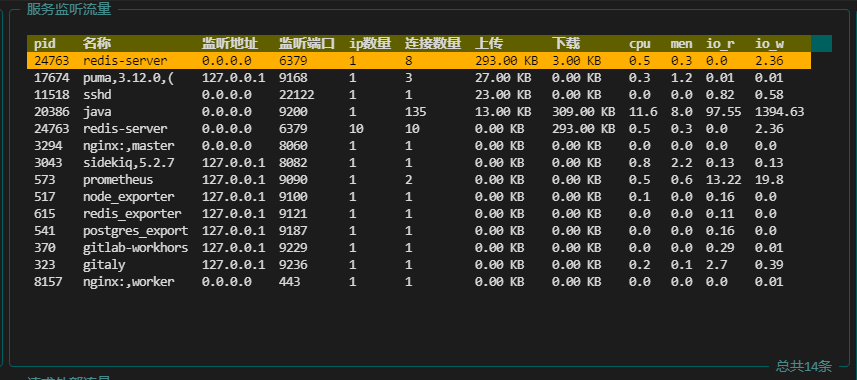

# TMD-TOP网络监控

#### 介绍
TMD-TOP是一款专为Linux终端设计的网络流量监控TUI工具，它能够实时、详细地追踪服务器内部客户端IP连接情况以及数据传输速率。通过该工具，用户可以直观了解到服务器上各个客户端IP的连接数量，精确到每个IP与服务器之间的上传和下载速率。

不仅如此，TMD-TOP还具备深入分析服务器内部应用程序（包括各种服务脚本）对外部请求的响应能力，展示每种服务或脚本发起的网络连接数以及它们对系统带宽资源的具体占用状况。这使得运维人员能够迅速识别出高带宽消耗的服务进程，进而优化服务器性能、合理分配网络资源，并确保整体系统的稳定性和效率。

此外，TMD-TOP提供清晰易读的表格输出，支持动态排序和筛选，便于用户快速定位潜在问题并进行故障排查。其强大的功能集及灵活的使用方式，使其成为Linux系统管理员和DevOps团队进行网络流量监控和性能调优的重要利器。


#### 版本要求

注意：

```txt
python >= 3.8
```

#### 环境要求

```txt
安装pidstat命令(apt install sysstat)
安装netstat命令(apt install net-tools)
```

#### 数据展示图

**服务器监听流量**



**服务器运行程序产生的流量**


**服务器网卡流量**


**详细pid流量**


#### 优点

 作为一名Linux运维人员，我发现FinalShell的流量视图功能在解决网络问题时极为实用且高效。尽管我曾尝试使用iftop和nload等工具进行流量监控，但它们的易用性和可视化效果仍无法与FinalShell相比。正是基于对FinalShell流量视图功能的认可和依赖，促使我萌生了参考其设计思路自行复刻类似工具的想法，以满足工作中对直观、精确网络流量监控的需求。 

#### 软件架构
1. 这里是列表文本数据收集模块：通过Python的subprocess或os库执行Linux底层命令（如netstat），实时获取服务器内部TCP连接的状态信息。这些信息包括但不限于客户端IP、端口、连接状态、传输速率等关键指标。

2. 这里是列表文本数据库存储模块：利用SQLite作为本地持久化存储解决方案，将收集到的TCP连接数据以结构化形式写入数据库表中。此模块负责创建和管理数据库连接，以及执行SQL插入操作。

3. 数据处理模块：对原始数据进行预处理和格式化，例如转换为适合存储在SQLite中的格式，并可能进一步进行数据分析，计算出如每秒上传下载速度、并发连接数等高级统计指标。

4. 用户界面展示模块：基于textual库构建终端界面，动态显示从数据库中读取的TCP连接统计数据。该


#### 安装教程

方式一（系统安装的python是3.8+）

```shell
sudo pip install tmd-top
```

#### 使用说明

在终端上执行运行tmd-top命令

```shell
root@davin-system:~/tmd-top# tmd-top
```

或

```shell
root@davin-system:~/tmd-top# /usr/local/bin/tmd-top
```

或（家目录.local/bin下）

```shell
root@davin-system:~/tmd-top# ~/.local/bin/tmd-top
```


#### 快捷指令

快捷指令


#### IP识别

ip识别是使用geoip来实现的，目前geoip的更新时间是： 2024-02-16 


请作者喝杯咖啡

如果该项目对你有帮助，帮您解决了问题，可以请作者喝杯咖啡！！!

