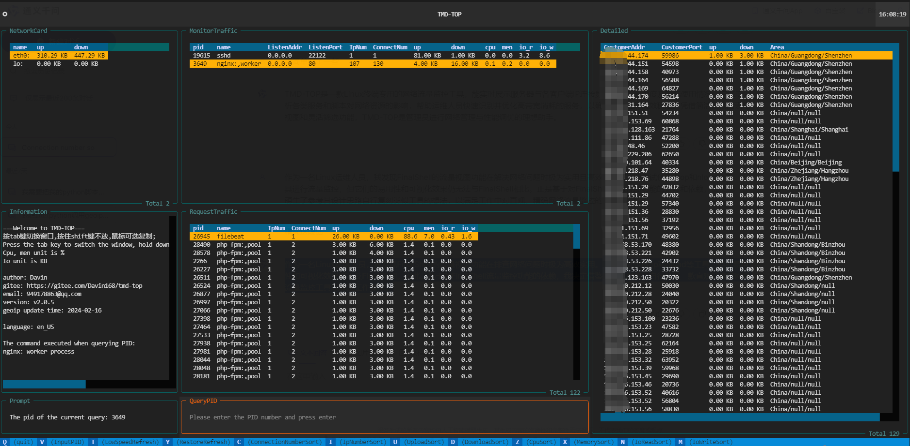

#  TMD-TOP network monitoring 

[[ 中文说明 ](/README.md)]

####  Introduction

 		TMD-TOP is a network traffic monitoring tool dedicated to Linux terminals. It can display the number of IP connections between the server and each client, upload and download speeds, and bandwidth usage in real time. It deeply analyzes the impact of various services and scripts on network resources, helping operation and maintenance personnel to quickly identify and optimize high-bandwidth-consuming services to ensure efficient and stable system performance. With its concise and easy-to-read table view and flexible filtering function, TMD-TOP is an ideal assistant for administrators in network management and performance tuning.



#### Version requirements

**Notice**：

```txt
python >= 3.8
```

#### Environmental requirements

```txt
Install pidstat command (apt install sysstat)
Install netstat command (apt install net-tools)
```

#### Installation tutorial

```shell
sudo pip install tmd-top
```

#### Instructions for use

Execute the tmd-top command on the terminal

```shell
root@davin-system:~/tmd-top# tmd-top
```

or

```shell
root@davin-system:~/tmd-top# /usr/local/bin/tmd-top
```

or（Under home directory .local/bin）

```shell
root@davin-system:~/tmd-top# ~/.local/bin/tmd-top
```


#### shortcut command

shortcut command


```txt
"q"---quit    #quit
'v'---InputPID		#Enter pid to query
't'---LowSpeedRefresh		#Refresh data slowly
'y'---RestoreRefresh		#Restore refresh data speed
'c'---ConnectionNumberSort	#Sort by number of connections
'i'---IpNumberSort		#IP number sorting
'u'---UploadSort			#Upload sorting
'd'---DownloadSort 		#Download sorting
'z'---CpuSort				#cpu sort
'x'---MemorySort			#Memory Sort
'n'---IoReadSort			#Io Read Sort
'm'---IoWriteSort			#Io Write Sort
```


#### IP identification

**Data source:** IP identification is implemented using geoip. The current update time of geoip is: 2024-02-16

**Chinese display area:** Change the language of the operating system to zh_CN, and use the `locale` command to view the system language.


#### Data display chart

**Server monitors traffic**


**Traffic generated by server running programs**


**Server network card traffic**


**Detailed client traffic**


#### creative ideas

​    As a Linux operation and maintenance personnel, I find that the traffic view function of FinalShell is extremely efficient and practical when troubleshooting network problems. Although I have tried tools such as iftop and nload, their ease of use and visualization are not as good as FinalShell. Therefore, in view of my reliance on FinalShell's traffic monitoring function, I decided to learn from its design ideas and develop an intuitive and accurate network traffic monitoring tool to meet my work needs.

#### Software Architecture
1. Here is the list text data collection module: execute Linux underlying commands (such as netstat) through Python's subprocess or os library to obtain the status information of the server's internal TCP connection in real time. This information includes but is not limited to client IP, port, connection status, transmission rate and other key indicators.
2. Here is the list text database storage module: Use SQLite as a local persistent storage solution to write the collected TCP connection data into a database table in a structured form. This module is responsible for creating and managing database connections, as well as performing SQL insert operations.

3. Data processing module: Preprocess and format the original data, such as converting it into a format suitable for storage in SQLite, and may further perform data analysis to calculate advanced statistical indicators such as upload and download speeds per second, number of concurrent connections, etc. .

4. User interface display module: build a terminal interface based on the textual library and dynamically display TCP connection statistics read from the database.


Ask the author for a cup of coffee

If this project was helpful to you and helped you solve your problem, you can buy the author a cup of coffee! ! !

