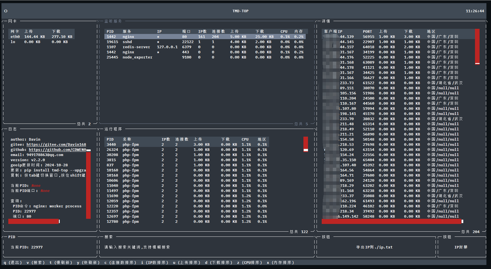
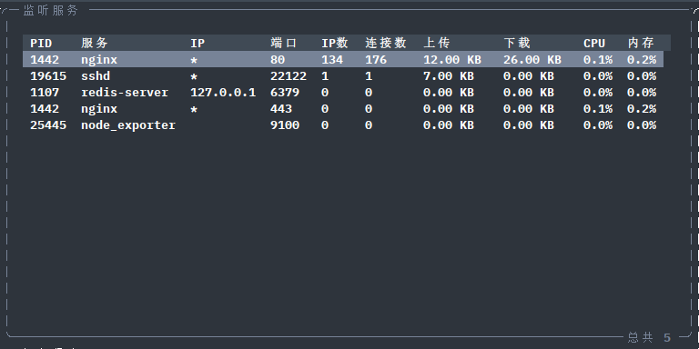
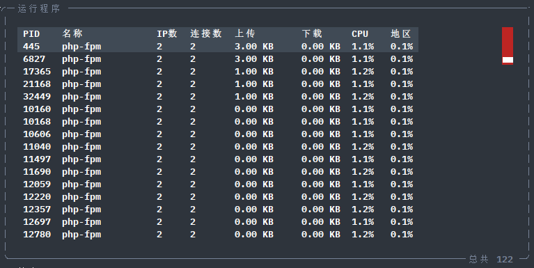
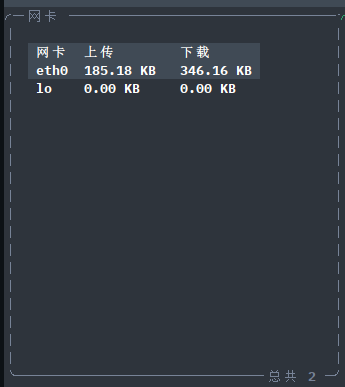
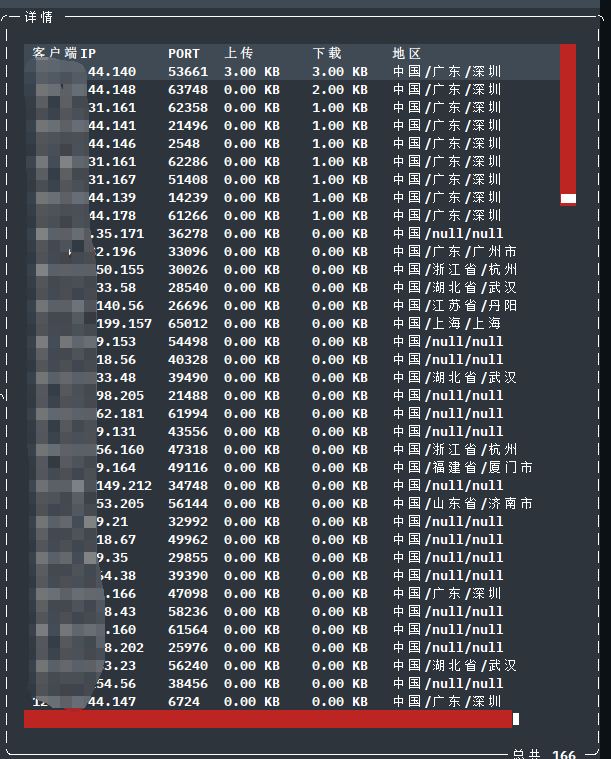
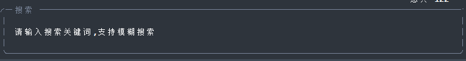
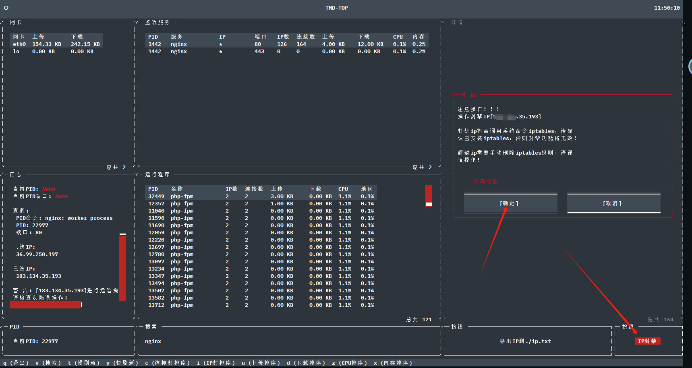

------


###  🌈 介绍

|🌐[[ 中文说明 ](/README.md)]  |🌐 [[ English   Introduction ](/en-README.md)] |

😈🖕TMD-TOP  是一款Linux终端专用的网络流量监控工具，能实时展示服务器与各客户端IP连接数、上传下载速度及带宽使用情况。它深度分析各类服务和脚本对网络资源的影响，帮助运维人员快速识别并优化高带宽消耗的服务，以确保系统性能高效稳定。凭借简洁易读的表格视图和灵活筛选功能，TMD-TOP是管理员进行网络管理与性能调优的理想助手。 

**顺手点个star⭐（非常重要）**



### 🔨 版本要求

 **⚠️注意：**

```txt
python >= 3.8

Linux system
```

###  🌈 安装教程

```shell
sudo pip install tmd-top
```

### 🔄更新

```shell
sudo pip install --upgrade tmd-top
```

### 📖使用说明

在终端上执行运行tmd-top命令

```shell
root@davin-system:~/tmd-top# tmd-top
或
root@davin-system:~/tmd-top# tmd
```

### ⌨️ 快捷指令

快捷指令


| 快捷指令 | 说明             |
| -------- | ---------------- |
| q        | 退出             |
| v        | 输入pid进行查询  |
| t        | 慢速刷新数据     |
| y        | 恢复刷新数据速度 |
| c        | 连接数排序       |
| i        | ip数量排序       |
| u        | 上传排序         |
| d        | 下载排序         |
| z        | CPU排序          |
| x        | 内存排序         |


### 🗺️IP识别

**数据来源:** ip识别是使用geoip来实现的，目前geoip的更新时间是：  ⌚️ 2024-12-20

### 📊 数据展示图

#### 服务器监听服务

监听服务一般指的是`ss -tunpl`在监听的服务



#### 服务器运行程序

运行程序指的是服务器内启动的常驻进程所产生的tcp连接，如：爬虫脚本，连接数据库的程序等。



#### 服务器网卡流量

服务器内各个网卡的总流量



#### 详细客户端流量

点击 `监听服务` 或 `运行程序` 的表格会展示出它的详细tcp流量信息，详细当某个服务建立了多少个连接，和哪个ip的哪个端口建立了连接，如：我的mysql 3306端口，我可以在`监听服务`点击mysql后会展示那些客户端连接了我的数据库，占用了多少带宽



#### 🔍 搜索

会根据你输入的内容帮你对`监听服务`、`运行程序`、`详情`内搜索你要的结果支持模糊搜索。

可以搜索：`pid`、`服务`、`端口`等



如：搜索nginx


#### 🛠️按钮

`导出IP到./ip.txt`：会对当前`详情`的ip信息，导出到当前目录的ip.txt文件内，方便你排查故障


`IP封禁`：该方法会调用系统的iptables方法，所以请谨慎使用，用鼠标在`详情`表里面点击一个你要封禁的IP，然后再点击IP封禁按钮，会弹出警告框，提示你是否封禁该IP。（ps：不推荐大家使用，封禁ip本就是危险行为）




**💻中英文切换**

tmd-top还做了中英文的识别，主要是对操作系统的语言环境进行判断，如果是中文系统环境，tmd-top会展示中文界面，英文环境同理，自行百度设置操作系统的语言。

判断系统语言

```shell
[root@test ~]# locale     #中文环境
LANG=zh_CN.UTF-8
LC_CTYPE="zh_CN.UTF-8"
LC_NUMERIC="zh_CN.UTF-8"
LC_TIME="zh_CN.UTF-8"
LC_COLLATE="zh_CN.UTF-8"
LC_MONETARY="zh_CN.UTF-8"
LC_MESSAGES="zh_CN.UTF-8"
LC_PAPER="zh_CN.UTF-8"
LC_NAME="zh_CN.UTF-8"
LC_ADDRESS="zh_CN.UTF-8"
LC_TELEPHONE="zh_CN.UTF-8"
LC_MEASUREMENT="zh_CN.UTF-8"
LC_IDENTIFICATION="zh_CN.UTF-8"
LC_ALL=

root@test ~# locale    #English environment
LANG=en_US.UTF-8
LANGUAGE=
LC_CTYPE="en_US.UTF-8"
LC_NUMERIC="en_US.UTF-8"
LC_TIME="en_US.UTF-8"
LC_COLLATE="en_US.UTF-8"
LC_MONETARY="en_US.UTF-8"
LC_MESSAGES="en_US.UTF-8"
LC_PAPER="en_US.UTF-8"
LC_NAME="en_US.UTF-8"
LC_ADDRESS="en_US.UTF-8"
LC_TELEPHONE="en_US.UTF-8"
LC_MEASUREMENT="en_US.UTF-8"
LC_IDENTIFICATION="en_US.UTF-8"
LC_ALL=

```


### 💡 创作想法

 作为一名Linux运维人员，我发现FinalShell的流量视图功能在排查网络问题时极为高效实用。尽管尝试过iftop和nload等工具，但其易用性和可视化效果均不及FinalShell。因此，鉴于对FinalShell流量监控功能的依赖，我决定借鉴其设计思路，自行开发一款直观精确的网络流量监控工具以满足工作需求。  

### 🏗️ 软件架构

1. 这里是列表文本数据收集模块：通过Python的subprocess或os库执行Linux底层命令（如netstat），实时获取服务器内部TCP连接的状态信息。这些信息包括但不限于客户端IP、端口、连接状态、传输速率等关键指标。

2. 这里是列表文本数据库存储模块：利用SQLite作为本地持久化存储解决方案，将收集到的TCP连接数据以结构化形式写入数据库表中。此模块负责创建和管理数据库连接，以及执行SQL插入操作。

3. 数据处理模块：对原始数据进行预处理和格式化，例如转换为适合存储在SQLite中的格式，并可能进一步进行数据分析，计算出如每秒上传下载速度、并发连接数等高级统计指标。

4. 用户界面展示模块：基于textual库构建终端界面，动态显示从数据库中读取的TCP连接统计数据。


 ☕ 请作者喝杯咖啡

如果该项目对你有帮助，帮您解决了问题，可以请作者喝杯咖啡！！!

